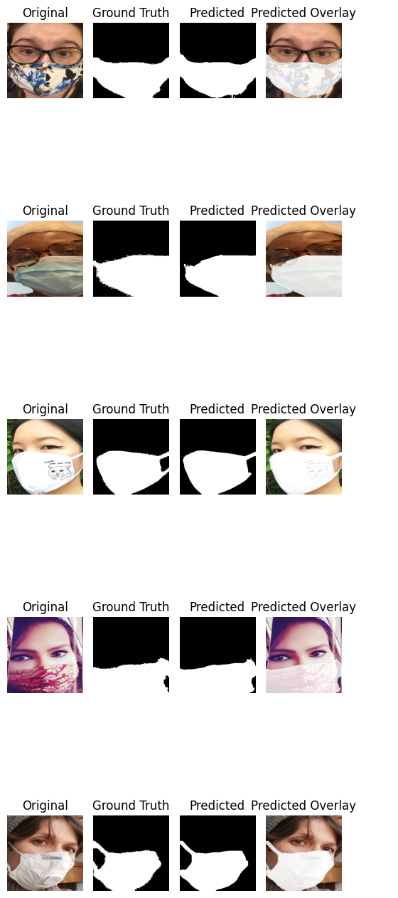
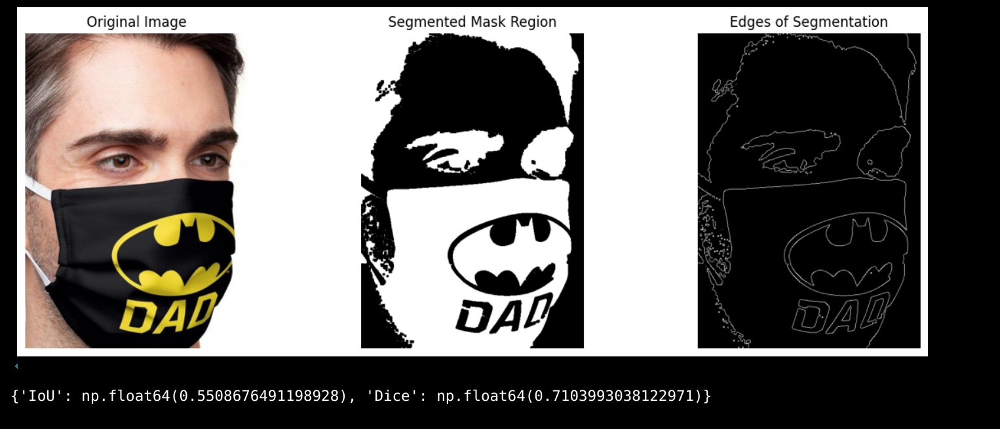
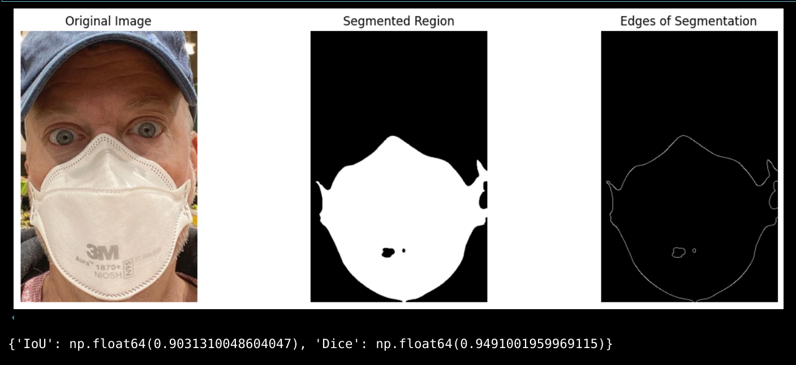
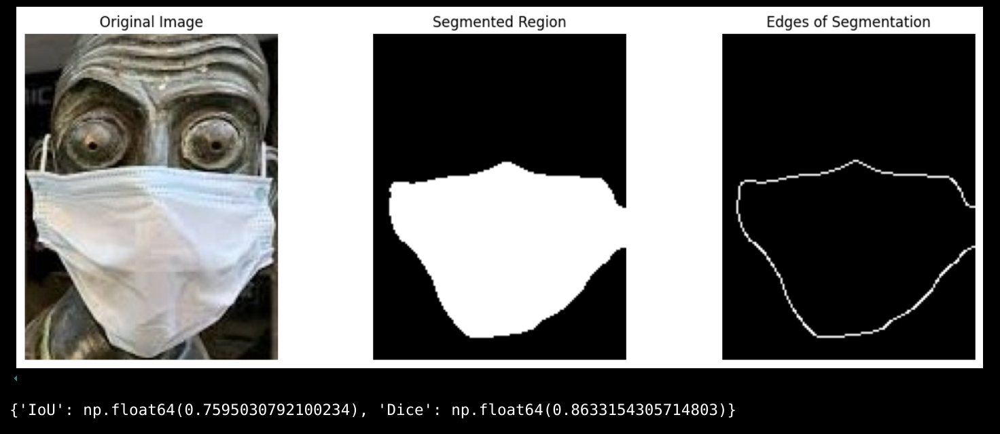
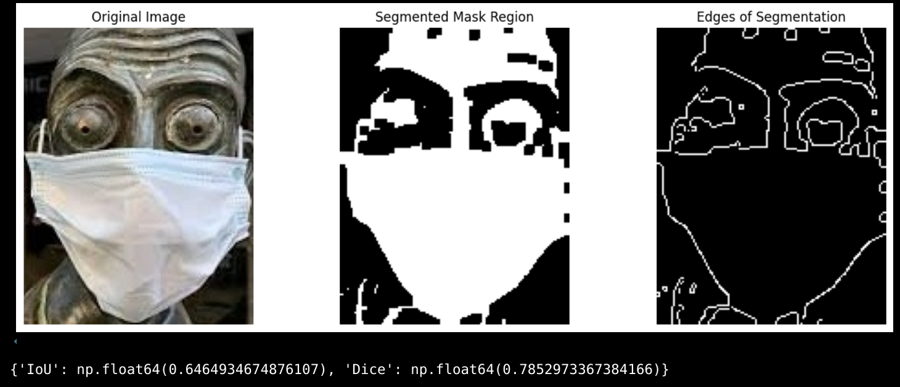
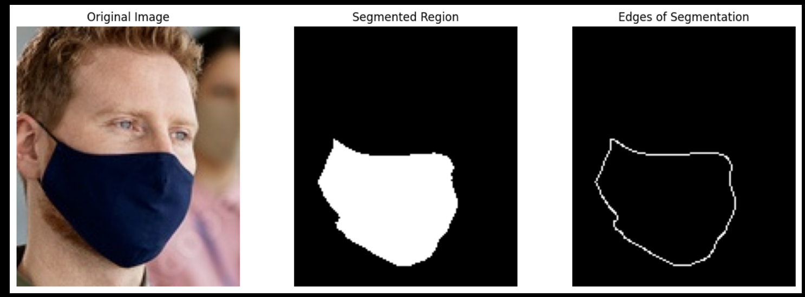
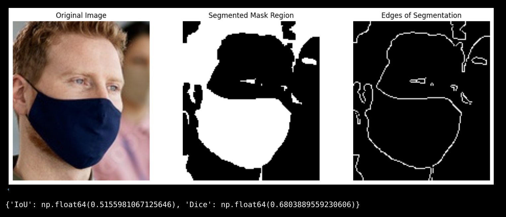

# Mask Detection and Segmentation Project

## 1. Introduction
This project focuses on detecting and segmenting face masks in images using various machine learning and deep learning techniques. The tasks include binary classification using handcrafted features and machine learning classifiers, binary classification using CNNs, region segmentation using traditional techniques, and mask segmentation using U-Net. The objective is to evaluate the performance of different approaches in terms of classification accuracy and segmentation quality.

### Contributors:

(IMT2022019) Daksh Rajesh <Daksh.Rajesh@iiitb.ac.in>

(IMT2022044) Jinesh Pagaria <Jinesh.Pagaria@iiitb.ac.in>

(IMT2022087) Aaditya Ramchandra Gole <Aaditya.Gole@iiitb.ac.in>

---

## 2. Dataset
### Source:
https://github.com/chandrikadeb7/Face-Mask-Detection/tree/master/dataset

https://github.com/sadjadrz/MFSD

```
MSFD
├── 1
│   ├── face_crop # face-cropped images of images in MSFD/1/img
│   ├── face_crop_segmentation # ground truth of segmend face-mask
│   └── img
└── 2
    └── img
```

```
dataset
├── with_mask # contains images with mask
└── without_mask # contains images without face-mask
```

### Structure:
- **Training Set:** Images used for training the models.
- **Testing Set:** Images used to evaluate model performance.
- **Annotations:** Mask region labels for segmentation tasks.

---

## 3. Objectives

### a. Binary Classification Using Handcrafted Features and ML Classifiers
1. Extract handcrafted features from facial images (e.g., HOG, LBP, SIFT).
2. Train and evaluate at least two machine learning classifiers (Here we use XGBoost and Neural Network) and compare classifier performances based on accuracy.

### b. Binary Classification Using CNN
1. Design and train a Convolutional Neural Network (CNN) for mask classification.
2. Experiment with different hyperparameters (learning rate, batch size, optimizer, activation function).
3. Compare CNN performance with traditional ML classifiers.

### c. Region Segmentation Using Traditional Techniques
1. Apply region-based segmentation methods (e.g., thresholding, edge detection) to segment mask regions, visualize and evaluate segmentation results.

### d. Mask Segmentation Using U-Net
1. Train a U-Net model to segment the mask regions in facial images.
2. Compare segmentation performance with traditional techniques using IoU or Dice score.

---

## 4. Hyperparameters and Experiments


### Hyperparameters Used in Part B

#### **Model Architecture Hyperparameters**  
| Hyperparameter         | Value              | Description |
|------------------------|-------------------|-------------|
| **Input Image Size**   | (128, 128, 3)     | Each image is resized to **128×128** with **3 channels (RGB)**. |
| **Number of Conv Layers** | 3 | Extracts hierarchical features. |
| **Filter Sizes**       | (3,3) | Kernel size used in Conv layers. |
| **Number of Filters per Layer** | 32 → 64 → 128 | Increasing filters to capture more complex features. |
| **Pooling Layer**      | MaxPooling2D (2×2) | Reduces spatial dimensions. |
| **Activation Function** | ReLU | Introduces non-linearity. |
| **Fully Connected Layer** | Dense(128, activation='relu') | Fully connected hidden layer. |
| **Dropout Rate**       | 0.5 | Prevents overfitting. |
| **Output Layer**       | Dense(1, activation='sigmoid') | Binary classification (mask/no-mask). |

---

#### **Training Hyperparameters**  
| Hyperparameter  | Value | Description |
|----------------|-------|-------------|
| **Optimizer**  | Adam  | Adaptive learning optimization. |
| **Loss Function** | Binary Crossentropy | Suitable for binary classification. |
| **Metrics**    | Accuracy | Evaluates performance. |
| **Epochs**     | 15 (tested 10/15/20) | Number of times model sees the dataset. |
| **Batch Size** | 64 (tested 32/64/96/128) | Number of images per batch. |
| **Weight Initialization** | Pre-saved Weights | Ensures consistent training across runs. |

---

#### **Data Augmentation & Preprocessing**  
| Hyperparameter  | Value | Description |
|----------------|--------|-------------|
| **Rescaling**  | 1/255  | Normalizes pixel values between 0 and 1. |
| **Augmentation** | None (Default) | The model performed best without augmentation. |
| **Alternative Augmentation Options** | Rotation (20°), Shift (0.2), Zoom (0.2), Shear (0.2), Flip | Commented out but available for use. |

---

#### **Dataset Splitting Hyperparameters**  
| Hyperparameter  | Value  | Description |
|----------------|--------|-------------|
| **Train Ratio** | 80% | Data used for training. |
| **Validation Ratio** | 10% | Used for tuning hyperparameters. |
| **Test Ratio** | 10% | Used for final model evaluation. |

### Part D

| Hyperparameter  | Description |
|----------------|--------|-------------|
| **Optimizer**  | Adam |
| **Learning Rate:** | Learning Rate: 0.001 |
| **Batch Size** | 20 |
| **Loss function** | DICE |

we experimented with different hyperparameters to optimize the performance of CNN and U-Net models for image segmentation. We ran with different loss functions (DICE, Binary cross), learning rates, epochs, batch sizes. The loss stopped reducing after aroung 18-20 epochs. The results below are from the best combination of hyperparameters.

    1. Learning Rate
    Value Used: 0.0001
    Optimizer: Adam (torch.optim.Adam)
    Reasoning: A small learning rate ensures stable convergence and prevents overshooting the optimal weights.
    2. Batch Size
    Value Used: Defined as BATCH_SIZE (used in DataLoaders)
    Impact: Controls the number of samples processed before updating model weights, affecting training stability and speed.
    3. Number of Epochs
    Value Used: 30
    Training Strategy: The model is trained over 30 iterations to allow convergence without overfitting.
    4. Optimizer
    Type: Adam (torch.optim.Adam)
    Reasoning: Adam is widely used for deep learning tasks due to its adaptive learning rate properties.
    5. Loss Function
    Finding: The loss function was not explicitly found in the extracted code.
    Potential Options: Could be CrossEntropyLoss or Dice Loss for segmentation.
    6. Activation Functions
    Finding: ReLU (torch.nn.ReLU) is likely used in CNN layers.

---

## 5. Results
### Evaluation Metrics:
- **Classification:** Accuracy, Precision, Recall, F1-score
- **Segmentation:** Intersection over Union (IoU), Dice Score

| Model | Accuracy (%) | IoU | Dice Score |
|--------|------------|----|-----------|
| XGBoost (part a) | 94.15% (80-20 train-test split) | - | - |
| Neural Network (part a)| 91.25% (80-20 train-test split) | - | - |
| CNN (part b) | 96.33% (80-10-10 train-validation-test split)| - | - |
| Region-growing (part c) | - | 0.3559 (mean) | 0.4798 (mean) |
| K-mean clustering  (part c) | Explained in section 6|
| U-Net Segmentation | 96.64% |91.37% | 95.09% |

### PART D results


- **Evaluation Metrics**:
  - Accuracy
  - Intersection over Union (IoU)
  - Dice Similarity Score

  <p align="center">
  
  
</p>


| Model | Accuracy | IoU | Dice Score |
|--------|------------|------|------------|
| U-Net | 0.9664 | 0.9137 | 0.9509 |

As we can see the unet model works much better than traditional methods

<p align="center">
  
  
</p>


---

## 6. Observations and Analysis


### PART A

For each image here we need to make a feature vector. We choose 5 features: color features, HoG, Edge features, texture featuresand ORB fetaures. 

***Since feature vector coresponding to images may be of diffrent lentgh, we resize all image and fix the length of individual sub-feature vectors, so that `np.hstack() `can work without interrupts when all individual sub-feature vectors ar combined into one vector for an image***. Data used is `dataset`. We train an XGBoost model as well as a neural network and as observed, the test accuracy of XGBoost is better. This is attributed to the fact that neural networks need a lot of data to learn and here we have 4095 images.

### PART B


### Project Overview
This project implements a **binary classification** task using a **Convolutional Neural Network (CNN)** to detect whether a person is wearing a face mask or not. The dataset is split into training, validation, and testing sets. Various **hyperparameters** such as batch size, learning rate, optimizer, and activation functions were experimented with to achieve the best performance. The CNN model's performance is then compared with traditional **Machine Learning (ML) classifiers**.

---

### Dataset Preparation
#### 1. Dataset Splitting
- The original dataset consists of two classes: `with_mask` and `without_mask`. A new dataset dataset_split is created consisting of the subdirectories train,test and val. These 3 further have 2 subdirectories 0 and 1.
- Images are split into **80% training, 10% validation, and 10% testing**.
- A script ensures images are valid and copied to their respective directories.

#### 2. Dataset Structure
```
dataset_split/
├── train/
│   ├── 0/  # Masked Images
│   ├── 1/  # Unmasked Images
├── val/
│   ├── 0/  # Masked Images for Validation
│   ├── 1/  # Unmasked Images for Validation
├── test/
│   ├── 0/  # Masked Images for Testing
│   ├── 1/  # Unmasked Images for Testing
```

---

### Model Architecture
A **CNN model** is designed with the following layers:
1. **Convolutional Layers**: Extract spatial features using **ReLU activation**.
2. **MaxPooling Layers**: Reduce spatial dimensions to prevent overfitting.
3. **Flatten Layer**: Converts feature maps into a single vector.
4. **Fully Connected (Dense) Layer**: Learns classification features.
5. **Dropout Layer (0.5)**: Reduces overfitting.
6. **Output Layer (Sigmoid Activation)**: Outputs a probability score for binary classification.

---

### Training and Hyperparameter Tuning
- **Batch Size:** 32/64/96/128 (Best: **64**)
- **Epochs:** 10/15/20 (Best: **15**)
- **Optimizer:** Adam
- **Loss Function:** Binary Cross-Entropy
- **Activation Function (Final Layer):** Sigmoid (compared with Softmax, Sigmoid performed better)
- **Data Augmentation:** Experimented but found that training without augmentation gave better results.

### Training Process
- **Initial Weights Saved & Loaded:** Ensuring consistent training across different runs.This was an important step because without having fixed initial weights and a seed ,the accuracy differed for the same hyperparameters.
- **Validation Set Used:** To monitor generalization.
- **Training Accuracy & Loss Plotted.**

---

### Results & Performance
- **Test Accuracy:** **96.33%**
- **Train Accuracy:** ~95.63%
- **Final Model Saved As:** `face_mask_cnn1.keras`

### Model Performance Graphs
The output graphs show:
- **Model Accuracy:** Training accuracy vs. validation accuracy
- **Model Loss:** Training loss vs. validation loss

---

### Evaluation
- **The CNN model significantly outperformed ML classifiers(by approximately 5 %) .**
- **Test accuracy (96.33%)** indicates strong generalization.
- **Testing on external images** The model gave a high accuracy for the images in the test dataset. However, when we checked the model on images where there was a full body view of the person and not just the face, there were inaccuracies.
- **Further improvements:** More hyperparameter tuning and deeper architectures. We can also try to further train the models on images where there is a full body view of the person and not just the face.

---

---

## Conclusion
This part of the project demonstrates the effectiveness of **CNNs for binary classification** in a face mask detection scenario. By tuning hyperparameters and optimizing model architecture, we achieved a high accuracy of **96.33%**, outperforming traditional ML classifiers.


### PART C

2 techniques used: K-means clustering based segmentation and Region-growing.

For K-means, k=2, one for mask region and another for backround.

Here for the choice of the 2 initial centroids, we use domain knowledge. The images are cropped to face-size which implies that it is higly likely that some region of the mask must be in the center of image. 

So we choose one centoid at center and another at corner.

For Region-based segmentaion, choice of initial seed here(only one) is center of the image, the 'why' of it backed by the reasoning provided above.

We find that K-means captures all pixels as part of mask that have more or less the intensity as mask. Secondly it is found that if the masks have design patterns of high contast, they are inevitably left out in mask segment no matter how much blurring you apply.
<p align="center">
  
  
</p>
[Results from K-means and ground truth mask for `MSFD/1/000003.jpg`]


We find that Region-growing technique is ***sensitive to tolerance***(the threshold difference for pixels be considered connected to seed). In cases where the tone of skin is comparable to that of face-mask, the tolerance needs to be drastically low to capture correct pixels.

<p align="center">
  
  
</p>
[Results from region-growing and ground truth mask for `MSFD/1/000058_1.jpg`]

<p align="center">
  
  
</p>

[Results from region-growing and k-means for `MSFD/1/000007_1.jpg`. Less false-positives in Region-growing.]

<p align="center">
  
  
</p>

[Results from region-growing and k-means for `MSFD/1/000013_1.jpg`. Less false-positives in Region-growing.]

In conclusion:
| K-means | Region-growing |
|--------|------------|
| Slower| Relatively faster|
| Highly likely to give false-positives (cases where mask tone matches hair, spectacle,etc)| Less likely to give false positives|
| Sensitive to number of iterations| Sensitive to tolerance|

Both the algorihtms rely on predefined parameters, they do not 'learn' and hence fail to generalise over large dataset (poor mean IoU and Dice scores). Computing mean IoU and Dice for K-means over 8500+ images is computationally expensive, moreover it is evident from its performance over random samples that its scores won't be significantly better region-growing.


---


### PART D

## 1. Methodology
### **Traditional Segmentation (Part C)**
- **Thresholding and Morphological Operations**: Basic segmentation based on pixel intensity.
- **Region-Based Segmentation**: Methods such as flooding and binary closing were applied.
- **K-Means Clustering**: Used to segment regions based on color similarity.

### **Deep Learning Models (Part D)**
- **CNN-based Segmentation**: Trained on facial images to predict masks.
- **U-Net Architecture**: A powerful fully convolutional network trained for pixel-wise classification.

Hyper parameters, and results shown above

## 4. Observations and Analysis
- **Traditional methods** work well for simple segmentation tasks but struggle with complex images.
- **CNN-based models** improve segmentation but may require extensive data augmentation.
- **U-Net** outperforms other approaches, providing the highest accuracy and IoU.
- Challenges include dealing with varying lighting conditions and occlusions, which were addressed using preprocessing techniques and data augmentation.

  
## 8. Conclusion
This part of the project demonstrates the effectiveness of deep learning techniques for face mask detection and segmentation. CNN models outperform traditional classifiers for binary classification, while U-Net provides more precise segmentation results. Further improvements can be achieved by using more complex architectures and larger datasets.

## 5. How to Run the Code
### Setup
1. Clone the repository:
   ```bash
   git clone https://github.com/JConquers/VR_Project_1
   cd VR_PROJECT_1
   ```
2. Install dependencies:
    
   ```bash
   python -m venv env
   source env/bin/activate
   pip install -r requirements.txt
   ```
3. Download the dataet from the source specified and put the 2 repositores `dataset` and `MSFD` at same directory level, immediately below repository level. Make directory `output`, command `mkdir output`. Final structure must look like :
    ```
    .
    ├── dataset
    ├── MSFD
    ├── output
    ├── scripts
    └── images
    
    # Other files like README.md, pdf, etc are not shown in this tree.
    ```
4. Run the scripts:
   
   `\scripts` contains 2 notebooks `part_a_b.ipynb` and `part_c_d.ipynb`, which contains scripts for the respective parts. They can be run all at once or one at a time to see partial results.

---


---

--------------------------------------------------------------------------------------------------------
